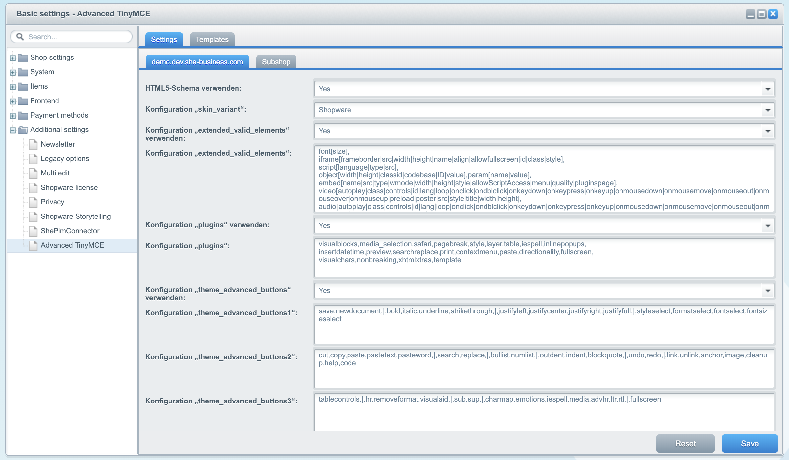

# Advanced TinyMCE

Features:
- Configure templates and use it in the editor
- All editor configurations can be edit over backend
- Add javascript in your html description

## Requirements

- Shopware 5.3

## Installation

- Download latest release from [Store](https://store.shopware.com/en/she4439287947287f/advanced-tinymce.html)
- Extract the zip file in `shopware_folder/custom/plugins/`

## Contributing

Feel free to fork and send pull requests!

## Licence

This project uses the [MIT License](LICENCE.md).
